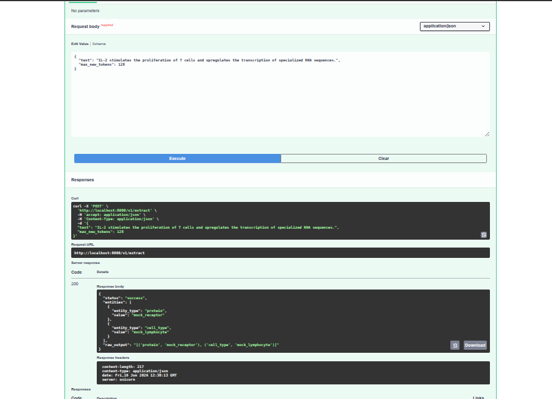
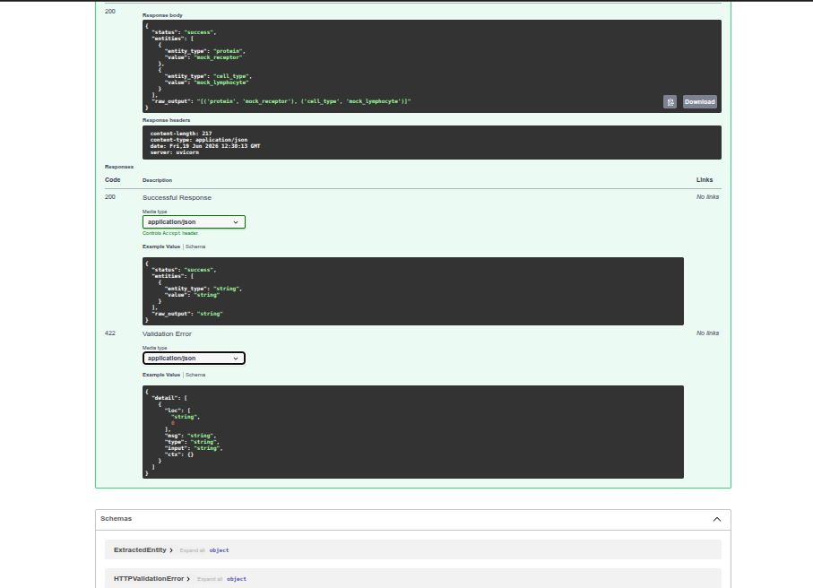

# BioNLP LLaMA-3 NER Microservice
A production-ready, hardware-aware FastAPI microservice designed for high-throughput Biological Named Entity Recognition (NER). This architecture bridges the gap between state-of-the-art LLM capabilities and resource-constrained production environments.

By leveraging Unsloth’s Triton-optimized inference kernels and 4-bit quantization, this microservice delivers low-latency entity extraction on minimal VRAM footprints, making it ideal for deployment on consumer-grade GPUs or edge-cloud instances.

## 🏗️ Technical Philosophy
This service moves away from monolithic model serving by enforcing a decoupled architecture:

- Compute Optimization: By utilizing 4-bit bitsandbytes quantization combined with Unsloth's optimized Triton kernels, we drastically reduce the VRAM overhead required to hold the model weights, enabling 8B parameter models to run on lower-tier GPUs (like the T4) without significant performance degradation.

- API-Inference Decoupling: The architecture separates the FastAPI ingestion layer from the heavy inference chassis. The API handles schema validation and payload parsing, while the engine manages stateful model execution. This allows for horizontal scaling of the API layer independently of the compute-heavy model engine.

- Deterministic Parsing: We bypass the unreliability of standard LLM generation by forcing structured output, which is then passed through a symbol-evaluation pipeline (ast.literal_eval). This ensures that the unstructured text output of the LLM is transformed into strict, type-safe data objects before reaching the client.

## 🔬 Practical Applications
This microservice is built to power high-utility biological data processing pipelines, including:

- Automated Biomedical Literature Mining: Extracting gene, protein, and cell-line mentions from thousands of PubMed abstracts at scale for meta-analysis.

- Clinical Decision Support Systems (CDSS): Parsing unstructured electronic health records (EHR) to map symptoms and biomarkers to standardized ontologies (e.g., SNOMED-CT or MeSH).

- Knowledge Graph Construction: Powering downstream automated graph construction by identifying entities and their relations (e.g., Protein-Protein Interactions or Drug-Target affinities) directly from raw scientific text.

- Drug Discovery Pipelines: Expediting target identification by enabling high-throughput semantic search over vast repositories of unstructured pharmaceutical patent data.

---

## 🏗️ System Architecture


The system implements a **Decoupled Micro-Kernel Architecture**, separating the API ingestion layer from the heavy-compute inference engine. This design allows for rapid development on local hardware (CPU) while ensuring high-performance production deployment on GPU clusters (CUDA).

### 1. Architectural Components

* **Ingestion Layer (FastAPI + Pydantic v2):** Serves as the service entry point. Pydantic v2 provides high-speed schema validation, ensuring that inbound requests meet specific type constraints before triggering any compute-heavy operations.
* **Abstraction Engine (`BioNLPEngine`):** A Factory-pattern wrapper that abstracts the hardware interface. It handles environment-aware initialization—switching dynamically between a `MockEngine` for local testing and a `TritonEngine` for production.
* **Inference Chassis (Unsloth + Triton):** The core execution layer. By utilizing Unsloth's optimized Triton kernels, we reduce the computational overhead of the LLaMA-3 8B model, achieving near-native inference speeds on consumer-grade and cloud-provider GPUs.
* **Deterministic Parsing Layer:** Unlike traditional LLM pipelines that rely on fragile Regex, this layer uses `ast.literal_eval()` for secure, symbolic evaluation. It creates a robust bridge between the probabilistic nature of the LLM and the deterministic needs of your downstream data structures.

### 2. Runtime Environment Strategy
The system utilizes the `RUNTIME_ENV` injection variable to modify the execution stack at startup, enabling seamless transition across development and deployment cycles.

| Environment | Engine Type | Capability | Target Hardware |
|:---|:---|:---|:---|
| `local` | `MockEngine` | Functional Schema Verification | Local CPU / IDE |
| `gpu` | `TritonEngine` | 4-bit Quantized Inference | NVIDIA GPU (T4/P100/A100) |

### 3. Execution Flow
The pipeline follows a strict, unidirectional state machine flow to minimize latency and ensure data integrity:

```
[HTTP Request] 
      ↓
[Pydantic Validation (Contract Verification)]
      ↓
[BioNLPEngine (State Check: Local vs. GPU)]
      ↓
[Model Generation (LLaMA-3 8B + 4-bit Quantization)]
      ↓
[Deterministic Parsing (AST Literal Evaluation)]
      ↓
[HTTP Response (Structured JSON Object)]
```

## 🧬 Model

- Base: *LLaMA-3 8B*
- Quantization: *Unsloth 4-bit* 
- ine-tuning:  *LoRA on biomedical NER*
  *This model takes a medical or biological text as input and identifies and extracts the following five entity types:*
  *- DNA*
  *- RNA*
  *- protein*
  *- cell_type*
  *- cell_line*
  
   The output is a clean, machine-readable Python list of tuples. read more : **[Arnic/llama-3-8b-bionlp-ner](https://huggingface.co/Arnic/llama-3-8b-bionlp-ner)**
  
- nference: *Triton kernels* 

---

## 💻 Local Setup

**1. Environment**
```bash
cd ~/bionlp-llama3-unsloth
python -m venv venv
source venv/bin/activate
pip install -r requirements-api.txt
```

**2. Launch**
```bash
python -m uvicorn api.main:app --host 0.0.0.0 --port 8000 --reload
```
App binds to `http://0.0.0.0:8000`.

---

## 🔬 API Usage

Navigate to **http://localhost:8000/docs** for the interactive UI.

| Method | Path | Purpose |
|:---|:---|:---|
| GET | `/health` | Liveness probe |
| POST | `/v1/extract` | NER extraction |
---


**Pipeline:**
```
[JSON In] → [Pydantic] → [BioNLPEngine] → [Parser] → [JSON Out]
```

### **The Extraction & Parsing Pipeline**

1. **Prompt Formatting:** Uses a rigid Alpaca instruction-tuning layout to minimize hallucinations and enforce context.
2. **Token Generation:** Constrains the LLM to output predictable Python-serialized tuples, optimizing for token density.
3. **Deterministic Isolation:** Middleware scans for the terminal `]` to truncate "trailing noise" common in LLM generations.
4. **Symbolic Evaluation:** Utilizes `ast.literal_eval()` for secure, risk-free conversion of string-based literals into typed objects.
5. **Pydantic Validation:** Maps unstructured extractions into rigid data contracts, ensuring strict schema compliance before the response exits the system.

---

## 🧪 Try It

1. Open `POST /v1/extract` in docs
2. Click **Try it out**
3. Paste:
```json
{
  "text": "IL-2 stimulates the proliferation of T cells and upregulates the transcription of specialized RNA sequences.",
  "max_new_tokens": 128
}
```
4. Click **Execute**
---


---
## 📸 Interface Gallery

| Initial Loading | Schema Interaction | Extraction Result |
|:---:|:---:|:---:|
|  |  |  |


## Target Production Deployment (Kaggle)
To process live biomedical literature with hardware acceleration via Unsloth's optimized Triton kernels:

1. Notebook Configuration

Accelerator: Set to GPU T4 x2 (or P100) in the right-hand sidebar.

Internet: Ensure the Internet toggle in the settings sidebar is set to On.

2. Environment Provisioning

```Python
!git clone https://github.com/aragit/bionlp-llama3-service.git
%cd bionlp-llama3-service
!pip install -r requirements-gpu.txt
```
3. Execution Launch

```Python
# Launch the inference gateway
!RUNTIME_ENV=gpu uvicorn api.main:app --host 0.0.0.0 --port 8000
```

*Note: Because Kaggle notebooks run in a container, the API will be accessible internally. To access this API from your local machine, you will need to tunnel the connection using a utility like ngrok.*

---

## 📋 Requirements & Prerequisites

### Prerequisites
Before installing the dependencies, ensure your environment meets the following specifications:

* **Python:** Version 3.10 or higher.
* **GPU Drivers (GPU Mode Only):** NVIDIA drivers with CUDA 12.x support installed.
* **Memory (GPU Mode Only):** Minimum 16GB RAM and a GPU with at least 8GB VRAM (T4/P100 recommended).

### Dependency Installation
The project uses environment-specific dependency files to manage the split between lightweight API testing and resource-heavy model execution.

| File | Use Case | Installation Command |
|:---|:---|:---|
| `requirements-api.txt` | Local testing, schema dev, CI/CD | `pip install -r requirements-api.txt` |
| `requirements-gpu.txt` | Production inference, Unsloth, Triton | `pip install -r requirements-gpu.txt` |

> **Note:** When deploying to production (Kaggle/Cloud), always use the `requirements-gpu.txt` file. This includes `bitsandbytes` and `triton` kernels required for 4-bit quantization which are not supported on standard CPU-only environments.
